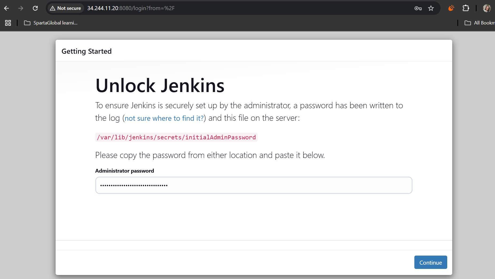
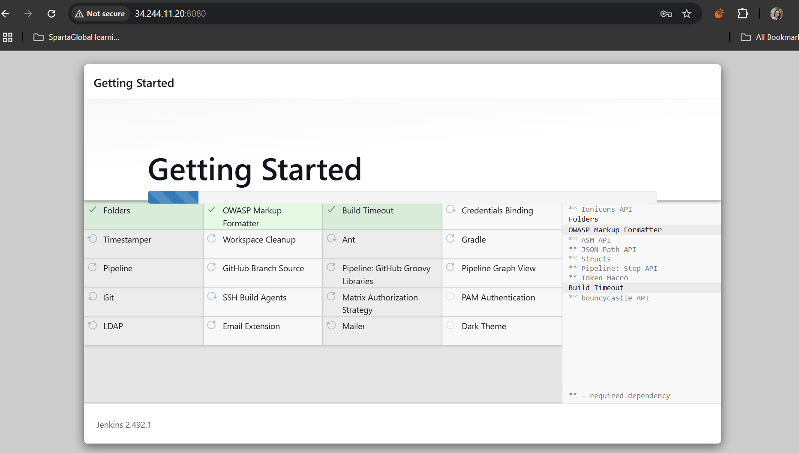

# Setting up my own Jenkins server 
- [Setting up my own Jenkins server](#setting-up-my-own-jenkins-server)
  - [Setting up Jenkins on my local machine](#setting-up-jenkins-on-my-local-machine)
  - [Setting up the AWS VPC](#setting-up-the-aws-vpc)
  - [Creating the two EC2 instances](#creating-the-two-ec2-instances)
  - [Setting up the Jenkins EC2](#setting-up-the-jenkins-ec2)
  - [Rebuilding the Jenkins pipeline](#rebuilding-the-jenkins-pipeline)
  - [Job 1](#job-1)
  - [Job 2](#job-2)
  - [Job 3](#job-3)
    - [Individual lines of code for Job 3 that worked](#individual-lines-of-code-for-job-3-that-worked)
  - [**Blockers**](#blockers)

## Setting up Jenkins on my local machine

1. Installed Chocolatey (to install Jenkins)

1. Install JDK 21 (a prerequisite for Jenkins) 
2. Installed Jenkins via Chocolatey (found on http://localhost:8080/ when Jenkins is running)
3. Installed Jenkins' suggested plugins

## Setting up the AWS VPC

- Set up my own VPC (10.0.0/16) with 1 subnet (10.0.0.0/28) 

## Creating the two EC2 instances

- Use Ubuntu 22.04 LTS
- For Sparta test app using Node JS 20: Use t3.micro
- Launch it in my own VPC created above
- One for app, one for Jenkins server

## Setting up the Jenkins EC2

- Followed [these steps](https://phoenixnap.com/kb/install-jenkins-ubuntu)

## Rebuilding the Jenkins pipeline

My server: http://54.154.104.199:8080/

add blocker and fix for github key

add jenkins commands (url) for restarting server etc.

## Job 1

- Followed my [Week 3 steps](https://github.com/farahc123/tech501-week3/blob/main/Jenkins%20CICD.md)

- Added webhook on github repo here

## Job 2

- Followed my [Week 3 steps](https://github.com/farahc123/tech501-week3/blob/main/Jenkins%20CICD.md)

## Job 3

`scp -o StrictHostKeyChecking=no -r /var/jenkins/workspace/sparta-app-job2-ci-merge/ ubuntu@ec2-34-244-68-243.eu-west-1.compute.amazonaws.com:/home/tech501-sparta-app/`

`ssh ubuntu@ec2-34-244-68-243.eu-west-1.compute.amazonaws.com << 'EOF'`
	
    `cd /home/ubuntu/tech501-sparta-app/`
  
    `npm install`
  
    `npm start`
`EOF`

- Path for edits: `/repo/nodejs20-sparta-test-app/app/views# nano index.ejs`

### Individual lines of code for Job 3 that worked

**works:**

`ssh ubuntu@ec2-34-244-68-243.eu-west-1.compute.amazonaws.com << 'EOF'`
  `cd /`
  `ls`

**works:**

`cd /var/lib/jenkins/workspace/sparta-app-job2-ci-merge/nodejs20-sparta-test-app/app/`

`scp -o StrictHostKeyChecking=no -r /var/lib/jenkins/workspace/sparta-app-job2-ci-merge/nodejs20-sparta-test-app ubuntu@ec2-34-244-68-243.eu-west-1.compute.amazonaws.com:/home/ubuntu/`

## **Blockers**

- I tested each job manually and they worked
- But for some reason my job 1 stopped working -- specifically, the `npm test` hung for ages on the Fibonacci point and then failed

