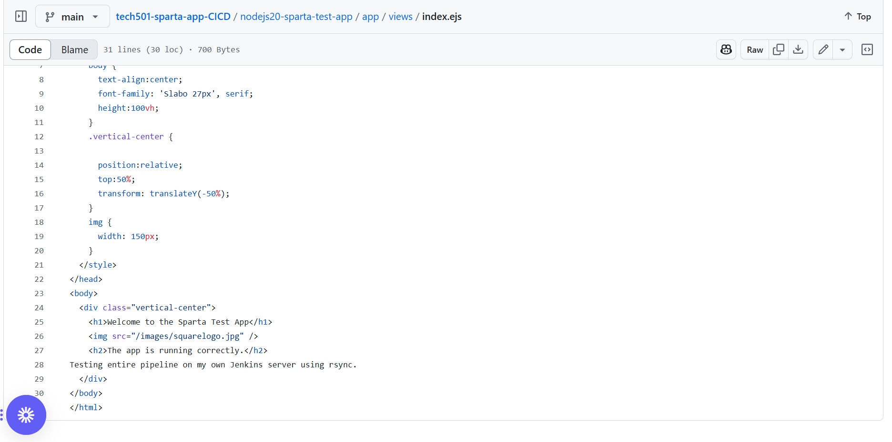
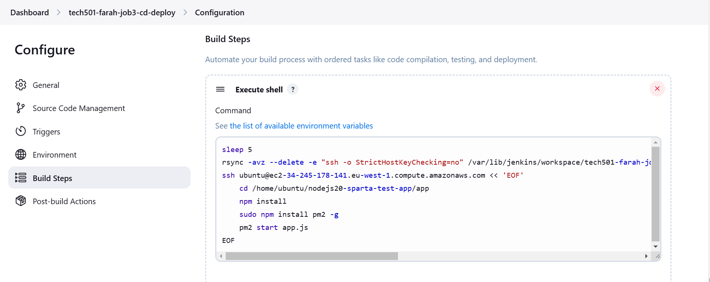

# Setting up my own Jenkins server 
- [Setting up my own Jenkins server](#setting-up-my-own-jenkins-server)
  - [Setting up Jenkins on my local machine](#setting-up-jenkins-on-my-local-machine)
  - [Setting up the AWS VPC](#setting-up-the-aws-vpc)
  - [Creating Jenkins EC2 instance](#creating-jenkins-ec2-instance)
  - [Setting up the Jenkins EC2](#setting-up-the-jenkins-ec2)
- [Rebuilding the Jenkins pipeline](#rebuilding-the-jenkins-pipeline)
  - [Job 1](#job-1)
  - [Job 2](#job-2)
  - [Job 3](#job-3)
  - [Old code store](#old-code-store)
      - [Individual lines of code for Job 3 that worked](#individual-lines-of-code-for-job-3-that-worked)
  - [**Blockers**](#blockers)

## Setting up Jenkins on my local machine

1. Installed Chocolatey (to install Jenkins)

1. Install JDK 21 (a prerequisite for Jenkins) 
2. Installed Jenkins via Chocolatey (found on http://localhost:8080/ when Jenkins is running)
3. Installed Jenkins' suggested plugins

## Setting up the AWS VPC

- Set up my own VPC (10.0.0/16) with 1 subnet (10.0.0.0/28) 


## Creating Jenkins EC2 instance

- Used Ubuntu 22.04 LTS
- t3.micro
- Launched it in my own VPC created above and used these security rules


## Setting up the Jenkins EC2

- Followed [these steps](https://phoenixnap.com/kb/install-jenkins-ubuntu) to install JDK and Jenkins on the EC2 instance
- My server: http://63.35.252.61:8080/ (screenshots below may be from earlier attempts)


# Rebuilding the Jenkins pipeline

- I manually added the SSH Agent and Nodejs plugins to my Jenkins server, specifying the latest 20... version of Nodejs as my only version

- **To fix the below issue**, you can change the default setting here to *Accept first connection*


- Path for edits on local repo: `/repo/nodejs20-sparta-test-app/app/views# nano index.ejs`


## Job 1

- Followed my [Week 3 steps](https://github.com/farahc123/tech501-week3/blob/main/Jenkins%20CICD.md)
- Version of Nodejs used:

- Added webhook on github repo here:

- Successful delivery of webhook:

- Successful pass of tests on Jenkins:

- Edit made on dev branch of local repo


## Job 2

- Followed my [Week 3 steps](https://github.com/farahc123/tech501-week3/blob/main/Jenkins%20CICD.md) but modified my post-build Git Publisher step to the below


- Successful console output:

- Successful merge to my main branch on GitHub:


## Job 3

- Followed my [Week 3 steps](https://github.com/farahc123/tech501-week3/blob/main/Jenkins%20CICD.md), adding both SSH keys to the SSH Agent plugin

- I did have to change the commands used in the build step -- `scp` was copying outdated files from previous Job 2 executions to my Sparta test app EC2 instance, so I switched to `rsync`
- I also added a `sleep 5` command in case Job 3 was being triggered slightly before Job 2 was actually done (note the indented code blocks)


```
sleep 5
rsync -avz --delete -e "ssh -o StrictHostKeyChecking=no" /var/lib/jenkins/workspace/tech501-farah-job2-ci-merge/nodejs20-sparta-test-app/app/ ubuntu@ec2-34-245-178-141.eu-west-1.compute.amazonaws.com:/home/ubuntu/nodejs20-sparta-test-app/app
ssh ubuntu@ec2-34-245-178-141.eu-west-1.compute.amazonaws.com << 'EOF'
	cd /home/ubuntu/nodejs20-sparta-test-app/app
    npm install
    sudo npm install pm2 -g
    pm2 start app.js
EOF
```

- Successful job execution from console output:

- Results reflected on my app EC2's public URL:


## Old code store


`scp -o StrictHostKeyChecking=no -r /var/jenkins/workspace/sparta-app-job2-ci-merge/ ubuntu@ec2-34-244-68-243.eu-west-1.compute.amazonaws.com:/home/tech501-sparta-app/`

`ssh ubuntu@ec2-34-244-68-243.eu-west-1.compute.amazonaws.com << 'EOF'`
	
    `cd /home/ubuntu/tech501-sparta-app/`
  
    `npm install`
  
    `npm start`
`EOF`

- Path for edits: `/repo/nodejs20-sparta-test-app/app/views# nano index.ejs`

#### Individual lines of code for Job 3 that worked

**works:**

`ssh ubuntu@ec2-34-244-68-243.eu-west-1.compute.amazonaws.com << 'EOF'`
  `cd /`
  `ls`

**works:**

`cd /var/lib/jenkins/workspace/sparta-app-job2-ci-merge/nodejs20-sparta-test-app/app/`


`scp -o StrictHostKeyChecking=no -r /var/lib/jenkins/workspace/sparta-app-job2-ci-merge/nodejs20-sparta-test-app ubuntu@ec2-34-244-68-243.eu-west-1.compute.amazonaws.com:/home/ubuntu/`


## **Blockers**

- I tested each job manually and they worked
- But for some reason my job 1 stopped working -- specifically, the `npm test` hung for ages on the Fibonacci point and then failed


working this out:
- I git cloned the app folder from my github repo and ran `npm test` locally -- all tests passed so I know there is no problem with the repo's app:


- I was unable to SSH into the Jenkins EC2 instance the next day (couldn't figure out why) so I ended up recreating the Jenkins EC2 from scratch using steps above
- For future, things to try:
  - update node to the latest 20. version
  - check `node -v` `npm -v` on jenkins server
  - "Sometimes, global modules or dependencies could be missing in Jenkins that are present locally. You can add this step to your Jenkins job:

```
bash
Copy
Edit
npm ci   # Clean install (more reliable than npm install)
```

- This ensures that your dependencies are installed exactly as defined in the package-lock.json.
- Additionally, if the tests rely on any global npm packages, you might need to install them globally in the Jenkins environment as well.
- `npm test -- --verbose`
- Sometimes Jenkins caches the node_modules directory and may not clean it properly between builds. Try clearing the cache in Jenkins by running:
`npm cache clean --force`
And ensure that the node_modules folder is deleted before doing a fresh install of dependencies."


